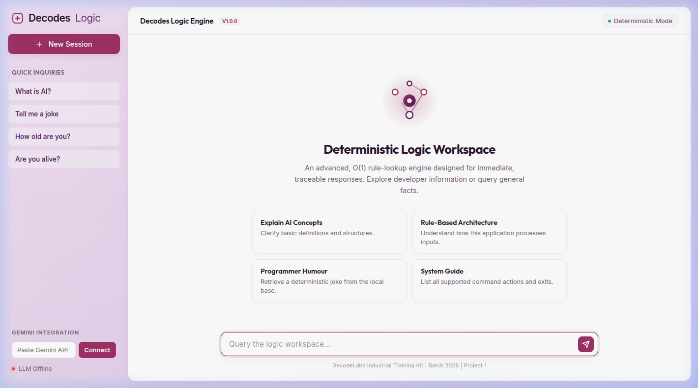
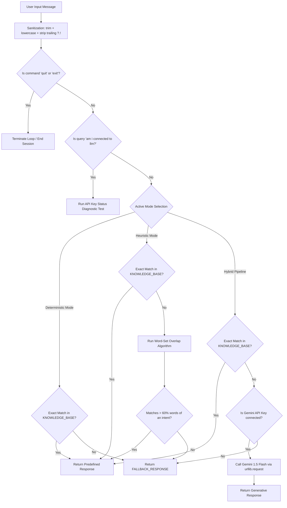

# DecodesBot — Rule-Based Chatbot & Hybrid LLM Pipeline
**DecodeLabs Industrial Training Kit | Batch 2026 | Project 1**

---

[](https://www.python.org/)
[](LICENSE)
[](testing/run_tests.py)
[](https://ai.google.dev/)
[](frontend/index.html)

---

## 🎨 Interface Preview



---

## 📂 Project Directory Structure

```filepath
Project1Decodelabs/
├── backend/
│   ├── chatbot.py           # Core deterministic rule-lookup logic engine
│   └── server.py            # Static file HTTP & JSON API server (CORS + Gemini integration)
├── frontend/
│   └── index.html           # Premium T3-inspired SPA Web interface
├── testing/
│   ├── test_chatbot_suite.py     # Unit, sanitization, edge, and static code compliance tests
│   ├── test_server_integration.py # Mock server API, CORS, and heuristic routing tests
│   └── run_tests.py         # Consolidated test suite execution runner
├── docs/
│   ├── TEST_PLAN.md         # Comprehensive QA verification test matrix
│   └── screenshot.png       # Viewport screenshot of the application interface
├── README.md                # Production project documentation
└── LICENSE                  # MIT License details
```

---

## ⚙️ Detailed Architectural Workflow

The DecodesBot operates via a hybrid routing pipeline. Depending on the active model selection and credential state, requests flow sequentially through deterministic, heuristic, and generative fallback paths:



---

## 🚀 How to Get Started

### 1. Requirements
*   Python 3.8 or higher.
*   No external third-party dependencies are required (relies strictly on standard library `http.server`, `urllib.request`, and `unittest`).

### 2. Run the Interactive CLI Chatbot
Interact with the chatbot logic loop directly in your console:
```bash
python3 backend/chatbot.py
```

### 3. Run the Web Interface Server
Start the HTTP and API server on port `8085`:
```bash
python3 backend/server.py
```
Open **[http://localhost:8085](http://localhost:8085)** in your web browser.

---

## 🧪 Automated Testing Suite

The testing folder includes a strict verification suite complying with the project’s QA plans. It validates:
*   **Functional Triggers (TC-F)**: Greetings, exits, help directories.
*   **Sanitization Pipelines (TC-S)**: Lowercasing, trailing space trimming, and punctuation removals.
*   **Edge Case Resilience (TC-E)**: Multi-word sequences, empty values, 500+ character stress tests, and consecutive unknowns.
*   **Static Code Reviews (CR)**: Scans python source code to enforce design gates (e.g. O(1) lookups, presence of `while True:`, `.get()`, and asserting no illegal `sys.exit()` calls or `if-elif` intent ladders).
*   **Server Integrations**: Validates OPTIONS preflight checks, CORS headers, validation routes, and heuristic lookups.

To run all 41 test cases:
```bash
python3 testing/run_tests.py
```

---

## 🔧 CORS Connection Pipeline

When executing the UI directly from local directories using the `file://` protocol:
1.  **CORS preflight handling**: The API server includes a `do_OPTIONS` handler which returns status `204` with wildcard access origins (`*`) and custom headers.
2.  **Adaptive Routing**: `index.html` automatically detects host mismatches or offline protocols and routes POST requests to `http://localhost:8085` dynamically.

---

## 📄 License

This project is licensed under the MIT License:

```
MIT License

Copyright (c) 2026 DecodeLabs Industrial Training Kit

Permission is hereby granted, free of charge, to any person obtaining a copy
of this software and associated documentation files (the "Software"), to deal
in the Software without restriction, including without limitation the rights
to use, copy, modify, merge, publish, distribute, sublicense, and/or sell
copies of the Software, and to permit persons to whom the Software is
furnished to do so, subject to the following conditions:

The above copyright notice and this permission notice shall be included in all
copies or substantial portions of the Software.

THE SOFTWARE IS PROVIDED "AS IS", WITHOUT WARRANTY OF ANY KIND, EXPRESS OR
IMPLIED, INCLUDING BUT NOT LIMITED TO THE WARRANTIES OF MERCHANTABILITY,
FITNESS FOR A PARTICULAR PURPOSE AND NONINFRINGEMENT. IN NO EVENT SHALL THE
AUTHORS OR COPYRIGHT HOLDERS BE LIABLE FOR ANY CLAIM, DAMAGES OR OTHER
LIABILITY, WHETHER IN AN ACTION OF CONTRACT, TORT OR OTHERWISE, ARISING FROM,
OUT OF OR IN CONNECTION WITH THE SOFTWARE OR THE USE OR OTHER DEALINGS IN THE
SOFTWARE.
```
